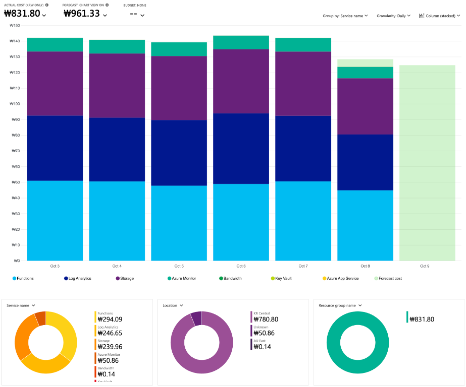

# 운영 비용 참고

제공된 Azure Cost Analysis 이미지의 금액을 운영 참고용으로 정리합니다. 웹 배포에는 [운영 비용 안내 페이지](../web/operations.html)가 포함되며, 주차 화면 하단의 **운영 비용 안내** 링크로 접근합니다. 정적 자료이고 실시간 Cost Management 조회나 청구서가 아닙니다.

첨부 이미지도 웹 페이지와 이 문서에 직접 포함합니다. 공개용 사본은 **리소스 그룹명 표시만 가리고 비용 숫자·그래프는 유지**했으며 첨부 원본은 수정하지 않았습니다. 이미지 메타데이터도 제거합니다. 구독/리소스 ID, 운영 주소와 인증정보는 공개하지 않습니다.

## 운영 비용 참고 이미지

[참고 이미지 크게 보기](../web/operating-cost-reference.png). 이미지의 연녹색 `Forecast cost` 구간은 실제 집계 비용이 아니라 예측입니다.

## 일별 비용으로 보는 월 운영비 예상

이미지의 실제 일별 비용 막대는 **150원 미만** 수준입니다. **같은 사용 패턴이 한 달 동안 이어진다**고 가정하고 하루 150원을 참고 기준으로 잡으면 다음처럼 예상할 수 있습니다.

| 참고 기준 | 계산 | 월 운영비 참고 예상 |
|---|---|---:|
| 30일 | **₩150 × 30일 = ₩4,500** | **약 ₩4,500** |
| 31일 | ₩150 × 31일 = ₩4,650 | 약 ₩4,650 |

따라서 현재 이미지의 사용 패턴에서는 **한 달 약 4,500원(30일 기준)**을 운영비 참고 예상으로 잡을 수 있습니다. 이는 정식 월 요금표, 확정 청구액이나 강제 비용 상한이 아닙니다. 실행량·로그 유입·저장 및 조회량·트래픽이 바뀌면 비용도 바뀝니다. 세금·할인·크레딧 적용 여부는 이미지로 확인되지 않습니다.

아래의 실제 비용 **₩831.80**과 차트 예측 **₩961.33**은 이미지에서 선택한 차트 범위의 금액이며 월 예상 **₩4,500**과 구분합니다. 예측 막대나 일부 집계된 날을 확정된 하루 실적으로 해석하거나, 표시 총액만으로 월 비용을 비례 환산하지 않습니다.

## 1. 판독 기준과 한계

| 항목 | 이미지 표시값 / 해석 |
|---|---|
| 통화 | KRW(원), 소수점 포함 |
| 실제 비용 (`Actual cost`) | **₩831.80** |
| 차트 예측 (`Forecast: Chart view`) | **₩961.33** |
| 예산 표시 (`Budget`) | `None` — 현재 운영 예산 설정은 별도 확인 필요 |
| 차트 축 | 10월 3일~9일, 일별(`Daily`), 서비스별 누적 막대 |
| 확인되지 않는 정보 | 연도, 정확한 조회 시작·종료일, 세금·할인·크레딧 적용 여부 |

- 차트에 보이는 날짜를 확정 청구 기간으로 간주하지 않습니다.
- **₩831.80과 ₩961.33을 월 운영비나 서비스 단가로 간주하지 않습니다.** 월 약 ₩4,500은 위에서 일별 비용과 30일 가정을 별도로 적용한 참고 예상입니다.
- 예측은 선택한 차트 범위의 전체 서비스 전망입니다. 확정 청구액이나 서비스별 예측이 아니며 실제 비용에 더하지 않습니다.
- 이미지 범례에 표시되거나 금액이 작다는 이유만으로 무료 서비스라고 판단하지 않습니다.

## 2. 서비스별 금액

| 서비스 | 판독 가능한 실제 비용 | 프로젝트의 관련 운영 항목 |
|---|---:|---|
| Functions | ₩294.09 | 주차·승객 데이터 수집 실행 시간, 메모리, 호출 횟수 |
| Log Analytics | ₩246.65 | Application Insights 등의 로그 유입량, 보존 기간, 중복 기록 |
| Storage | ₩239.96 | 원본·정규화·공개 데이터 저장량과 읽기·쓰기 트랜잭션 |
| Azure Monitor | ₩50.86 | 수집 중단·함수 실행 감시 등 알림과 모니터링 사용 내역 |
| Bandwidth | ₩0.14 | 데이터 전송량과 외부 조회 트래픽 |
| Key Vault | 판독 불가 | API 키 보관·조회. 범례는 보이지만 개별 금액 확인 불가 |
| Azure App Service | 판독 불가 | 범례의 앱/호스팅 서비스 분류. 별도 과금 여부는 명세 확인 필요 |

판독 가능한 5개 서비스 합계는 **₩831.70**입니다. 이미지의 실제 총액 **₩831.80**과의 차이 **₩0.10**은 **미배분 차액**으로 유지합니다. Key Vault, Azure App Service 등에 임의 배분하거나 판독 불가 항목을 ₩0으로 기록하지 않습니다.

이 프로젝트의 웹 호스팅은 Static Web Apps입니다([구성](DEPLOYMENT.md#1-구성과-배포-경계)). 이미지에서 이 서비스의 개별 금액은 확인되지 않으며 Azure App Service 범례와 동일한 서비스라고 단정하지 않습니다. 각 서비스의 세부 미터·실제 과금 원인은 원본 Cost Analysis 또는 비용 명세에서 확인해야 합니다.

## 3. 이미지의 지역별 금액

| 이미지 지역 표기 | 실제 비용 |
|---|---:|
| KR Central | ₩780.80 |
| Unknown | ₩50.86 |
| AU East | ₩0.14 |
| **합계** | **₩831.80** |

`Unknown`을 특정 지역이나 리소스로 임의 매핑하지 않습니다. 지역별 비용은 이미지의 분류이며 배포 위치를 변경하거나 해당 지역에 새 리소스를 만들 근거가 아닙니다.

## 4. 운영 점검 절차

1. Azure Cost Management → Cost Analysis에서 대상 범위, 조회 시작·종료일, 통화, 비용 종류와 필터를 기록합니다. 서비스별 비교는 `Group by: Service name`, `Granularity: Daily`로 맞춥니다.
2. 실제 비용과 차트 예측을 분리해서 비교합니다. 청구 정보는 지연 반영될 수 있으므로 화면 캡처 시점과 최종 명세를 함께 확인합니다.
3. 이 스냅샷에서는 Functions → Log Analytics → Storage 순으로 비용이 큽니다. 리소스·미터별 내역과 실제 사용량을 확인한 후 원인을 판단합니다.
   - **Functions:** 실행 시간, 메모리, 재시도와 중복 실행을 점검합니다. 비용 참고 자료 때문에 5분 수집 주기를 변경하지 않습니다.
   - **Log Analytics:** 로그 유입량과 중복 기록을 점검합니다. [모니터링 템플릿](../infra/modules/monitoring.bicep)은 30일 보존, 일일 0.05GB 수집 한도, Application Insights 50% 샘플링을 정의하지만 실제 운영 설정과는 별도로 비교해야 합니다. 장애 분석에 필요한 로그를 무조건 제거하지 않습니다.
   - **Storage:** 저장 용량뿐 아니라 읽기·쓰기 트랜잭션도 확인합니다. 과거 공개 기록과 원본 삭제는 보존 정책 승인 후 별도 진행합니다.
   - **Azure Monitor / Bandwidth / Key Vault:** 알림 규칙, 데이터 전송과 키 조회의 세부 과금 내역을 확인합니다. 감시나 키 접근 보호를 비용만으로 끄지 않습니다.
4. 예산이 필요한 경우 **운영자가 승인한 금액·통화**로 실제 비용 및 예측 비용 알림을 별도 설정합니다. 예산 알림은 리소스를 자동 중지하거나 과금을 차단하지 않습니다.
5. 변경 후 같은 범위·기간 기준으로 비용과 데이터 수집 정상 여부를 함께 비교합니다. 참고 이미지 갱신 시 공개용 이미지, 이 문서와 웹 페이지, 이미지·비용 수치·월 예상 가정을 검증하는 [빌드 테스트](../tests/build.test.cjs)를 함께 업데이트합니다.

[예산 템플릿](../infra/modules/alerts.bicep)의 월 예산 `amount: 10`은 인프라 템플릿 값입니다. 첨부 이미지의 `Budget: None`이나 KRW 표시에서 현재 예산 금액·통화를 유추할 수 없으므로 실제 Azure 설정을 확인하고 별도 승인 없이 변경하지 않습니다.

## 5. 배포 범위

- 비용 참고 이미지, 웹 페이지와 운영 문서만 추가합니다. 새 Azure 리소스나 Cost Management API 연동을 만들지 않습니다.
- 기존 데이터, 수집 주기, API 키, 권한, 인프라, 모니터링·예산 설정을 변경하지 않습니다.
- 비용 페이지는 JavaScript나 운영 데이터 없이 읽을 수 있고 검색 색인에서는 제외합니다.
- [웹 빌드](../scripts/build-web.mjs)에 페이지와 이미지가 포함되고 [배포 검증](../scripts/verify-deployment.mjs)이 실제 웹 페이지 내용과 이미지 파일이 원본과 일치하는지 확인합니다.
- 신규 설치나 설정 변경은 [배포 설명서](DEPLOYMENT.md)를 따릅니다.

## 공식 참고 자료

- [Azure 비용 분석과 예측](https://learn.microsoft.com/en-us/azure/cost-management-billing/costs/cost-analysis-common-uses)
- [Azure 예산·알림](https://learn.microsoft.com/en-us/azure/cost-management-billing/costs/tutorial-acm-create-budgets)
